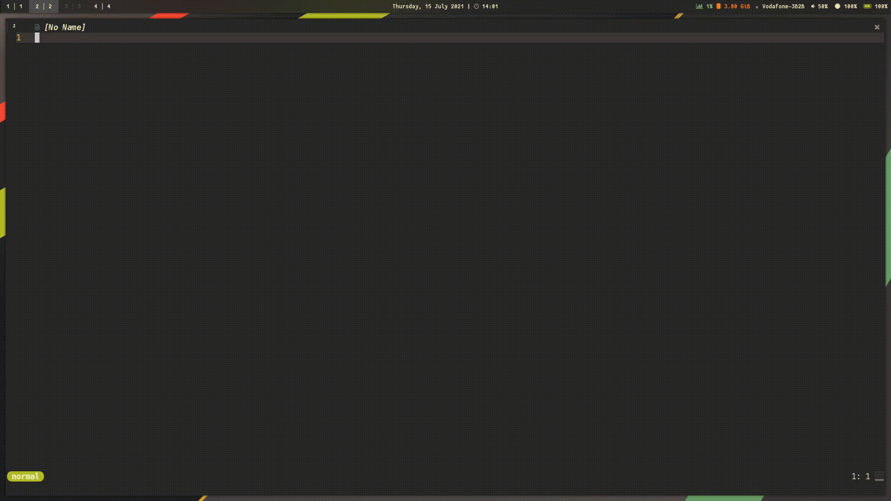

# telescope-hop.nvim
(Teles-)Hopping to the moon.

`telescope-hop.nvim` is an extension for telescope.nvim. It helps you navigate, select, and perform actions on results buffer with motions inspired by hop.nvim.

## Demo
The demo illustrates the standard `hop` motion to jump to an result entry and a custom `hop_loop` (see setup below) that sequentially toggles the hopped-to-entry for selection and sends the entries to the quickfix list upon completion of the loop.




## Installation

Install `telescope-hop.nvim` with your favorite package manager.

### vim-plug

```viml
Plug 'nvim-telescope/telescope-hop.nvim'
```

### packer.nvim

```lua
use {'nvim-telescope/telescope-hop.nvim'}
```

## Telescope Setup and Configuration:

```lua
require("telescope").setup {
  extensions = {
    hop = {
      -- Highlight groups to link to signs and lines; the below configuration refers to demo
      sign_hl = { "WarningMsg", "Title" }, -- sign_hl typically only defines foreground to possibly be combined with line_hl
      line_hl = { "CursorLine", "Normal" }, -- optional, typically a table of two highlight groups that are alternated between
      -- options specific to `hop_loop`
      clear_selection_hl = false,           -- true temporarily disables Telescope selection highlighting
      trace_entry = true,                   -- highlight hopped to entry with telescope selection highlight; mutually exclusive with `clear_selection_hl`
      reset_selection = true,               -- jump to entry where hoop loop was started from
    },
  }
}
-- To get the extension loaded and working with telescope, you need to call
-- load_extension, somewhere after setup function:
require('telescope').load_extension('hop')
```

## Usage

`telescope-hop.nvim` currently includes the following default actions. Actions without the `_` prefix rely on the default configuration, whereas actions that comprise the `_` prefix are meant to be combined in custom actions with possibly their own configurations (faulting back to set defaults).

| Action                     | Description                                                                                               |
|----------------------------|-----------------------------------------------------------------------------------------------------------|
| `hop.hop`                  | hop to entry with default configuration                                                                   |
| `hop.hop_toggle_selection` | hop loop that toggles selection on hop (see demo)                                                         |
| `hop._hop`                 | hop to entry configurable on-the-fly                                                                      |
| `hop._hop_loop`            | start configurable hop loop to iteratively do `callback` on hop and `loop_callback` once loop is finished |

You can set up the mappings in the `setup` function of `telescope.nvim`. **Warning**: default actions need to passed as [hot-reloaded functions](https://github.com/tjdevries/config_manager/blob/b9490fe7eb47e2bf21e828474787d8b8e8ed5314/xdg_config/nvim/lua/tj/globals.lua#L6) ("`R`"), as otherwise the configuration is improperly applied, since the mappings would require the extension without having your configuration set up. 

```lua
local telescope = require "telescope"
telescope.setup {
  defaults = {
    mappings = {
      i = {
        -- WARNING telescope has to be either hot-reloaded or wrapped in `function(prompt_bufnr) telescope.extensions.hop.hop end`
        ["<C-h>"] = R("telescope").extensions.hop.hop,  -- hop.hop_toggle_selection
        -- custom hop loop that multi selects upon hopping and sends selected entries to quickfix list 
        ["<C-space>"] = function(prompt_bufnr)
          local opts = {
            callback = actions.toggle_selection,
            loop_callback = actions.send_selected_to_qflist,
          }
          require("telescope").extensions.hop._hop_loop(prompt_bufnr, opts)
        end,
      },
    },
  },
}
telescope.load_extension "hop"
```

## TODO

- [ ] Docgen will likely not work out-of-the-box :)
